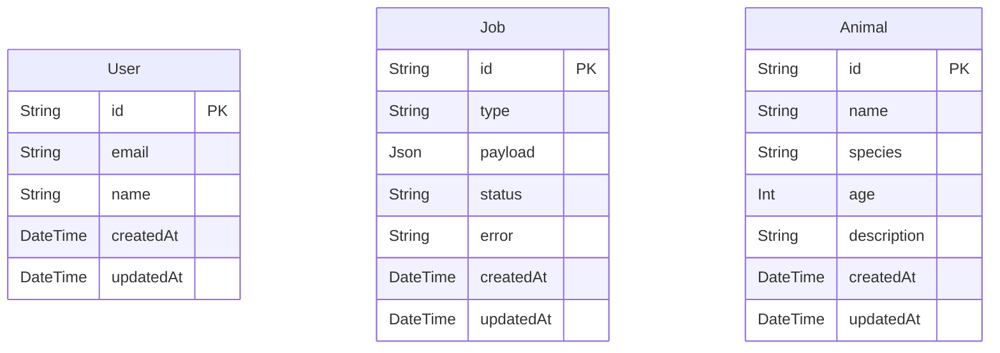

# feat: Add Animal API endpoint and database model

## Enhancement Summary

**Deepened on:** 2026-08-13
**Research agents used:** TypeScript reviewer, security sentinel, performance oracle, architecture strategist, data integrity guardian, code simplicity reviewer, best-practices researcher, framework docs researcher, pattern recognition specialist, spec-flow analyzer

### Key Improvements Discovered

1. **Replace all `as` casts with Fastify route generics** — `req.body as object` on PUT is a critical vulnerability enabling mass assignment
2. **Add Fastify JSON Schema with `additionalProperties: false`** on every route — runtime validation, not just TypeScript types
3. **Switch from `prisma db push` to `prisma migrate`** — `db:push` can silently drop columns; no migration history
4. **Add mandatory pagination** on `GET /animals` — unbounded `findMany()` is a reliability risk at scale, not just a latency concern
5. **Drop `UpdateAnimalInput`** — no consumer; use `Partial<CreateAnimalInput>` instead
6. **Use `PrismaClientKnownRequestError` P2025** for 404s on update/delete — catching generic errors hides root causes
7. **Add `@@index([createdAt])`** — required for stable cursor pagination sort order

### New Considerations Discovered

- Auth is intentionally out of scope for v1 but must be documented as a gap
- `GET /animals` must have a hard `take` cap even without full pagination
- Response schemas on routes strip fields, preventing accidental data leakage
- The `.js` extension on all relative imports is a hard requirement under NodeNext ESM
- `vi.mock("../db.js")` must be the very first statement in test files

---

## Overview

Add a full CRUD REST API for animals, backed by a new `Animal` Prisma model in PostgreSQL. This includes the database schema, shared TypeScript types, Fastify route handlers, Vitest unit tests, and a basic frontend display page.

## Problem Statement / Motivation

The app currently only has a `/health` check endpoint. There is no domain data or business logic. Adding an `Animal` resource demonstrates the full stack: Prisma schema → shared types → Fastify routes → Next.js UI — and gives the project a meaningful, testable feature to build on.

## Proposed Solution

1. Add `Animal` model to `apps/api/prisma/schema.prisma`
2. Add shared TypeScript types for `Animal` in `packages/shared`
3. Implement CRUD routes in `apps/api/src/routes/animals.ts`
4. Register routes in `apps/api/src/app.ts`
5. Write Vitest unit tests for each route
6. Display animals on the Next.js home page

## Technical Considerations

- Follow existing route module pattern: `export async function animalRoutes(app: FastifyInstance)`
- Follow existing Prisma singleton pattern from `apps/api/src/db.ts`
- Follow existing shared-type pattern (interface + input type, exported from `packages/shared/src/index.ts`)
- Fastify's `app.inject()` + `vi.mock('../db.js')` test pattern — must stay consistent
- Use CUID for `id` (`@default(cuid())`) to match `User` and `Job` models
- `createdAt`/`updatedAt` timestamps follow existing convention
- All relative imports use `.js` extension — required by `NodeNext` module resolution

### Research Insights: Architecture

**Route registration:** Use `app.register(animalRoutes, { prefix: '/animals' })` in `buildApp()`. Routes inside can then use `'/'` and `'/:id'` instead of `'/animals'` and `'/animals/:id'`, making the plugin prefix-reusable.

**No service layer:** Direct Prisma calls in route handlers is the established pattern. The existing `healthRoutes` calls `prisma.$queryRaw` directly. Introducing a service layer only for animals would create inconsistency.

**Monorepo boundary:** Do NOT add `@prisma/client` to `packages/shared`. The web and worker would transitively pull in the generated Prisma client. Keep hand-written interfaces in shared — this is the established pattern for `User` and `Job`.

**Frontend:** Use a React Server Component (RSC) calling `getAnimals()` server-side, following the existing `page.tsx` + `getHealth()` pattern. No `"use client"`, no `useEffect`.

**`getAnimals()` return type:** Return `Animal[] | null` (null only on actual error, empty array on success with zero records). The existing `getHealth()` collapses both into `null` — avoid repeating that ambiguity for list endpoints.

## Database Schema Change

```prisma
// apps/api/prisma/schema.prisma (addition)
model Animal {
  id          String   @id @default(cuid())
  name        String   @db.VarChar(100)
  species     String   @db.VarChar(100)
  age         Int?
  description String?  @db.VarChar(1000)
  createdAt   DateTime @default(now())
  updatedAt   DateTime @updatedAt

  @@index([createdAt])
  @@index([species, createdAt])
}
```

### Research Insights: Database Schema

**`db:push` vs `prisma migrate` — Critical:** `prisma db push` has no migration history and can silently drop columns on incompatible changes. Use `prisma migrate dev` in development (generates SQL migration files) and `prisma migrate deploy` in CI/CD. Add `db:migrate:dev` and `db:migrate:deploy` scripts to `apps/api/package.json`. This is the most impactful infrastructure change beyond the feature itself.

**`@db.VarChar(n)` constraints:** An unbounded `String` maps to `TEXT` in PostgreSQL (up to 1 GB). Add length bounds to prevent: oversized payload DoS, unbounded index entries on `species`, and accidental data corruption. `@db.VarChar(100)` on name/species, `@db.VarChar(1000)` on description.

**`age` validation:** PostgreSQL `INT` accepts negative values. Either: (a) add a `CHECK` constraint via raw SQL in the migration (`age >= 0`), or (b) enforce at the application layer via Fastify JSON Schema (`minimum: 0`). Do both.

**Dropped `@@index([species])` alone:** The `species`-only index is superseded by the composite `@@index([species, createdAt])`. When filtering by species and sorting by `createdAt` (the natural evolution), a composite index handles both; two single-column indexes force PostgreSQL to pick one and sort the other in memory.

**`@@index([createdAt])` is required:** Without it, the paginated list query (`ORDER BY createdAt DESC`) does a full sequential scan + sort on every page request.

**Soft-delete decision:** Do NOT add `deletedAt` for v1 — it introduces complexity (every `findMany` needs `where: { deletedAt: null }`) without a current use case. Document it as a known gap. Add it when cascading deletes or audit requirements arise.

### ERD



## API Endpoints

| Method | Path | Description | Status codes |
|--------|------|-------------|--------------|
| GET | `/animals` | List animals (paginated) | 200 |
| GET | `/animals/:id` | Get a single animal | 200, 404 |
| POST | `/animals` | Create an animal | 201, 400 |
| PUT | `/animals/:id` | Partially update an animal | 200, 400, 404 |
| DELETE | `/animals/:id` | Delete an animal | 204, 404 |

### Request / Response shapes

**GET /animals querystring:** `?limit=20&cursor=<base64url_encoded_id>` (optional, defaults to `limit=20`, no cursor = first page)

**POST /animals body:**
```json
{ "name": "Leo", "species": "Lion", "age": 5, "description": "Majestic mane" }
```
Required: `name`, `species`. Optional: `age`, `description`.

**PUT /animals/:id body:** Partial update — any subset of `name`, `species`, `age`, `description`. All fields optional; at least one must be present.

**GET /animals response:**
```json
{
  "data": [{ "id": "clx...", "name": "Leo", "species": "Lion", "age": 5, "description": "Majestic mane", "createdAt": "...", "updatedAt": "..." }],
  "pagination": { "hasNextPage": true, "nextCursor": "base64url_string_or_null" }
}
```

**Error response** (consistent across all routes):
```json
{ "statusCode": 404, "error": "Not Found", "message": "Animal not found" }
```

**400 response** (invalid body):
```json
{ "statusCode": 400, "error": "Bad Request", "message": "body must have required property 'name'" }
```

### Research Insights: Request Validation

**Fastify JSON Schema is mandatory, not optional.** TypeScript route generics (`<{ Body: T }>`) only give compile-time types — they do NOT validate at runtime. Without a `schema.body`, a POST with `{ name: 123, species: null }` passes straight to Prisma. AJV validation is built into Fastify; it costs no extra dependency.

**`additionalProperties: false` on every body schema.** This closes mass assignment: any field not in the schema is rejected before the handler runs. Without it, a client can POST `{ "id": "attacker-id", "createdAt": "1970-01-01" }` and override Prisma-generated values.

**CUID regex on params.** Validate `:id` format before hitting the database:
```json
{ "type": "string", "pattern": "^c[a-z0-9]{24}$" }
```
A malformed ID would otherwise cause Prisma to throw an unhandled error.

**Auth is out of scope for v1** but must be documented. Without auth, anyone can DELETE all animals. This is an accepted v1 limitation. Add a `preHandler` auth hook before shipping to production.

## Acceptance Criteria

- [ ] `Animal` model present in `apps/api/prisma/schema.prisma` with all fields and indexes above
- [ ] `prisma migrate dev` (not `db:push`) applied successfully in dev
- [ ] `Animal` and `CreateAnimalInput` types exported from `@myapp/shared` (no `UpdateAnimalInput` — use `Partial<CreateAnimalInput>`)
- [ ] `GET /animals` returns `200` with `{ data: Animal[], pagination: { hasNextPage, nextCursor } }`
- [ ] `GET /animals` respects `?limit` (default 20, max 100) and `?cursor`
- [ ] `GET /animals/:id` returns `200` with animal or `404` if not found
- [ ] `GET /animals/:id` returns `400` for syntactically invalid `:id` (non-CUID)
- [ ] `POST /animals` with valid body returns `201` with created animal
- [ ] `POST /animals` with missing required fields returns `400`
- [ ] `POST /animals` with unknown fields returns `400` (additionalProperties: false)
- [ ] `PUT /animals/:id` returns `200` with updated animal or `404` if not found
- [ ] `PUT /animals/:id` with invalid body returns `400`
- [ ] `DELETE /animals/:id` returns `204` or `404` if not found
- [ ] Vitest unit tests cover all routes including invalid body cases
- [ ] Route registered in `buildApp()` in `apps/api/src/app.ts` with `{ prefix: '/animals' }`
- [ ] `pnpm --filter api run test` passes
- [ ] Next.js home page lists animals fetched server-side from the API

## Implementation Files

### New files

- `packages/shared/src/types/animal.ts` — Animal interfaces
- `apps/api/src/routes/animals.ts` — Fastify route handlers
- `apps/api/src/routes/animals.test.ts` — Vitest tests
- `apps/api/prisma/migrations/<timestamp>_add_animal/migration.sql` — generated by `prisma migrate dev`

### Modified files

- `apps/api/prisma/schema.prisma` — add Animal model
- `packages/shared/src/index.ts` — export Animal types
- `apps/api/src/app.ts` — register `animalRoutes`
- `apps/web/src/lib/api.ts` — add `getAnimals()` fetch function
- `apps/web/src/app/page.tsx` — render animal list
- `apps/api/package.json` — add `db:migrate:dev` and `db:migrate:deploy` scripts

## MVP Code Sketches

### packages/shared/src/types/animal.ts

```typescript
// Nullable Prisma fields use `Type | null`, NOT `Type?`
// Optional input fields use `?`, NOT `| null`
export interface Animal {
  id: string;
  name: string;
  species: string;
  age: number | null;
  description: string | null;
  createdAt: Date;
  updatedAt: Date;
}

export interface CreateAnimalInput {
  name: string;
  species: string;
  age?: number;
  description?: string;
}

// No UpdateAnimalInput — callers use Partial<CreateAnimalInput>
```

### apps/api/src/routes/animals.ts

```typescript
import type { FastifyInstance } from "fastify";
import { prisma } from "../db.js";
import { Prisma } from "@prisma/client";

const createSchema = {
  body: {
    type: "object",
    required: ["name", "species"],
    additionalProperties: false,
    properties: {
      name:        { type: "string", minLength: 1, maxLength: 100 },
      species:     { type: "string", minLength: 1, maxLength: 100 },
      age:         { type: "integer", minimum: 0, maximum: 200 },
      description: { type: "string", maxLength: 1000 },
    },
  },
} as const;

const updateSchema = {
  body: {
    type: "object",
    additionalProperties: false,
    minProperties: 1,
    properties: {
      name:        { type: "string", minLength: 1, maxLength: 100 },
      species:     { type: "string", minLength: 1, maxLength: 100 },
      age:         { type: "integer", minimum: 0, maximum: 200 },
      description: { type: "string", maxLength: 1000 },
    },
  },
} as const;

const idParamSchema = {
  params: {
    type: "object",
    properties: { id: { type: "string", pattern: "^c[a-z0-9]{24}$" } },
    required: ["id"],
  },
} as const;

const listQuerySchema = {
  querystring: {
    type: "object",
    properties: {
      limit:  { type: "integer", minimum: 1, maximum: 100, default: 20 },
      cursor: { type: "string" },
    },
  },
} as const;

export async function animalRoutes(app: FastifyInstance): Promise<void> {
  // GET /animals — cursor-paginated list
  app.get<{ Querystring: { limit?: number; cursor?: string } }>(
    "/",
    { schema: listQuerySchema },
    async (req, reply) => {
      const limit = req.query.limit ?? 20;
      const cursorId = req.query.cursor
        ? Buffer.from(req.query.cursor, "base64url").toString("utf8")
        : undefined;

      const animals = await prisma.animal.findMany({
        take: limit + 1,
        skip: cursorId ? 1 : 0,
        cursor: cursorId ? { id: cursorId } : undefined,
        orderBy: { createdAt: "desc" },
      });

      const hasNextPage = animals.length > limit;
      const data = hasNextPage ? animals.slice(0, limit) : animals;
      const last = data[data.length - 1];

      return reply.send({
        data,
        pagination: {
          hasNextPage,
          nextCursor: hasNextPage && last
            ? Buffer.from(last.id).toString("base64url")
            : null,
        },
      });
    }
  );

  // GET /animals/:id
  app.get<{ Params: { id: string } }>(
    "/:id",
    { schema: idParamSchema },
    async (req, reply) => {
      const animal = await prisma.animal.findUnique({ where: { id: req.params.id } });
      if (!animal) return reply.status(404).send({ statusCode: 404, error: "Not Found", message: "Animal not found" });
      return reply.send(animal);
    }
  );

  // POST /animals
  app.post<{ Body: { name: string; species: string; age?: number; description?: string } }>(
    "/",
    { schema: createSchema },
    async (req, reply) => {
      const animal = await prisma.animal.create({ data: req.body });
      return reply.status(201).send(animal);
    }
  );

  // PUT /animals/:id — partial update
  app.put<{ Params: { id: string }; Body: Partial<{ name: string; species: string; age: number; description: string }> }>(
    "/:id",
    { schema: { ...idParamSchema, ...updateSchema } },
    async (req, reply) => {
      try {
        const animal = await prisma.animal.update({
          where: { id: req.params.id },
          data: req.body,
        });
        return reply.send(animal);
      } catch (err) {
        if (err instanceof Prisma.PrismaClientKnownRequestError && err.code === "P2025") {
          return reply.status(404).send({ statusCode: 404, error: "Not Found", message: "Animal not found" });
        }
        throw err;
      }
    }
  );

  // DELETE /animals/:id
  app.delete<{ Params: { id: string } }>(
    "/:id",
    { schema: idParamSchema },
    async (req, reply) => {
      try {
        await prisma.animal.delete({ where: { id: req.params.id } });
        return reply.status(204).send();
      } catch (err) {
        if (err instanceof Prisma.PrismaClientKnownRequestError && err.code === "P2025") {
          return reply.status(404).send({ statusCode: 404, error: "Not Found", message: "Animal not found" });
        }
        throw err;
      }
    }
  );
}
```

### apps/api/src/routes/animals.test.ts

```typescript
import { describe, it, expect, beforeEach, afterEach, vi } from "vitest";
import type { FastifyInstance } from "fastify";

// vi.mock MUST be the very first executable statement (Vitest hoisting requirement)
vi.mock("../db.js");

import { buildApp } from "../app.js";
import { prisma } from "../db.js";

const mockAnimal = {
  id: "cla123456789012345678901234",
  name: "Leo",
  species: "Lion",
  age: 5,
  description: null,
  createdAt: new Date(),
  updatedAt: new Date(),
};

describe("Animal routes", () => {
  let app: FastifyInstance;

  beforeEach(() => { app = buildApp(); });
  afterEach(async () => { await app.close(); });

  describe("GET /animals", () => {
    it("returns 200 with paginated list", async () => {
      prisma.animal.findMany.mockResolvedValue([mockAnimal]);
      const res = await app.inject({ method: "GET", url: "/animals" });
      expect(res.statusCode).toBe(200);
      expect(res.json()).toHaveProperty("data");
      expect(res.json().pagination).toHaveProperty("hasNextPage");
    });
  });

  describe("GET /animals/:id", () => {
    it("returns 200 when found", async () => {
      prisma.animal.findUnique.mockResolvedValue(mockAnimal);
      const res = await app.inject({ method: "GET", url: `/animals/${mockAnimal.id}` });
      expect(res.statusCode).toBe(200);
      expect(res.json()).toStrictEqual(expect.objectContaining({ name: "Leo" }));
    });

    it("returns 404 when not found", async () => {
      prisma.animal.findUnique.mockResolvedValue(null);
      const res = await app.inject({ method: "GET", url: `/animals/${mockAnimal.id}` });
      expect(res.statusCode).toBe(404);
    });

    it("returns 400 for invalid CUID format", async () => {
      const res = await app.inject({ method: "GET", url: "/animals/not-a-cuid" });
      expect(res.statusCode).toBe(400);
    });
  });

  describe("POST /animals", () => {
    it("returns 201 with created animal", async () => {
      prisma.animal.create.mockResolvedValue(mockAnimal);
      const res = await app.inject({
        method: "POST",
        url: "/animals",
        payload: { name: "Leo", species: "Lion" },
      });
      expect(res.statusCode).toBe(201);
    });

    it("returns 400 for missing required fields", async () => {
      const res = await app.inject({
        method: "POST",
        url: "/animals",
        payload: { name: "Leo" }, // missing species
      });
      expect(res.statusCode).toBe(400);
    });

    it("returns 400 for unknown fields", async () => {
      const res = await app.inject({
        method: "POST",
        url: "/animals",
        payload: { name: "Leo", species: "Lion", hack: "injected" },
      });
      expect(res.statusCode).toBe(400);
    });
  });

  describe("PUT /animals/:id", () => {
    it("returns 200 on success", async () => {
      prisma.animal.update.mockResolvedValue({ ...mockAnimal, name: "Simba" });
      const res = await app.inject({
        method: "PUT",
        url: `/animals/${mockAnimal.id}`,
        payload: { name: "Simba" },
      });
      expect(res.statusCode).toBe(200);
    });

    it("returns 404 when not found", async () => {
      const { Prisma } = await import("@prisma/client");
      prisma.animal.update.mockRejectedValue(
        new Prisma.PrismaClientKnownRequestError("Not found", { code: "P2025", clientVersion: "5.0.0" })
      );
      const res = await app.inject({
        method: "PUT",
        url: `/animals/${mockAnimal.id}`,
        payload: { name: "X" },
      });
      expect(res.statusCode).toBe(404);
    });
  });

  describe("DELETE /animals/:id", () => {
    it("returns 204 on success", async () => {
      prisma.animal.delete.mockResolvedValue(mockAnimal);
      const res = await app.inject({ method: "DELETE", url: `/animals/${mockAnimal.id}` });
      expect(res.statusCode).toBe(204);
    });

    it("returns 404 when not found", async () => {
      const { Prisma } = await import("@prisma/client");
      prisma.animal.delete.mockRejectedValue(
        new Prisma.PrismaClientKnownRequestError("Not found", { code: "P2025", clientVersion: "5.0.0" })
      );
      const res = await app.inject({ method: "DELETE", url: `/animals/${mockAnimal.id}` });
      expect(res.statusCode).toBe(404);
    });
  });
});
```

### Pattern consistency rules (from pattern-recognition-specialist)

| Rule | Correct | Wrong |
|---|---|---|
| Nullable schema field → interface | `field: string \| null` | `field?: string` |
| Optional input field → interface | `field?: string` | `field: string \| null` |
| Import FastifyInstance | `import type { FastifyInstance }` | `import { FastifyInstance }` |
| Relative imports | `"../db.js"` | `"../db"` or `"../db.ts"` |
| Shared re-export | `export type { Animal }` | `export { Animal }` |
| Test assertions | `toStrictEqual` | `toEqual` |
| Mock placement | First line after imports | After `buildApp` import |
| `mockReset` | Already in `__mocks__/db.ts` | Don't add it to test file too |

## Dependencies & Risks

- **No new npm packages needed for v1** — Prisma, Fastify AJV validation, and Vitest are already installed
- **DB migration:** Switch to `prisma migrate dev` — requires Docker Compose postgres to be running
- **`prisma generate`** must run after schema change so `prisma.animal.*` methods are type-safe
- **Mock shape:** `__mocks__/db.ts` auto-mocks Prisma via `vitest-mock-extended` — `prisma.animal.*` methods available automatically

### Future security additions (out of scope for v1, document as known gaps)

- `@fastify/rate-limit` — prevent enumeration and bulk deletion
- `@fastify/helmet` — security headers
- `@fastify/cors` — restrict origins
- Authentication `preHandler` hook on all mutating routes
- Soft-delete pattern when audit trail requirements arise

## References

- Existing route pattern: `apps/api/src/routes/health.ts`
- Existing test pattern: `apps/api/src/routes/health.test.ts`
- Prisma mock: `apps/api/src/__mocks__/db.ts`
- Shared types pattern: `packages/shared/src/types/user.ts`, `packages/shared/src/types/job.ts`
- Schema source of truth: `apps/api/prisma/schema.prisma`
- Fastify TypeScript generics: https://fastify.dev/docs/latest/Reference/TypeScript/
- Prisma error reference: https://www.prisma.io/docs/orm/reference/error-reference
- Prisma pagination: https://www.prisma.io/docs/orm/prisma-client/queries/pagination
